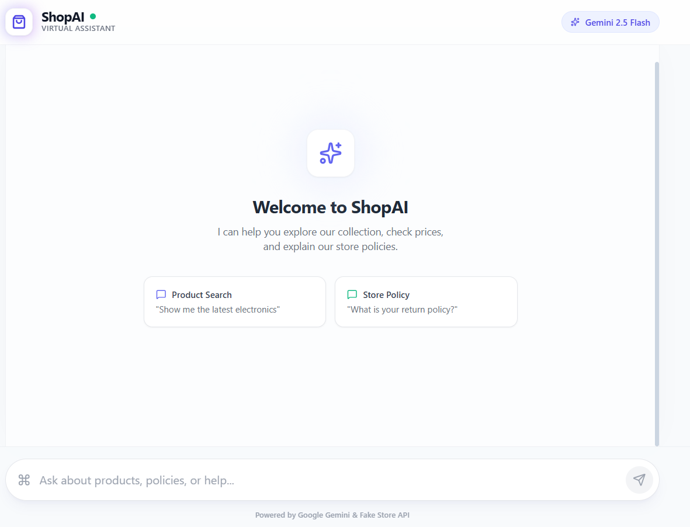

# ShopAI 🛍️

An AI-powered shopping assistant built with React and Google Gemini API.

## Author

**Name:** G.D.K. Kumarasiri  
**Student Email:** s22000447@ousl.lk

## Features

- 💬 Conversational shopping assistant
- 🔍 Product search and discovery
- 📦 Order status tracking
- 📞 Customer support routing and callback scheduling
- 🛡️ Built-in guardrails for safe interactions

## Run Locally

### Prerequisites

- Node.js (v18 or higher recommended)
- A Google Gemini API key ([Get one here](https://aistudio.google.com/apikey))

### Setup

1. **Install dependencies:**
   ```bash
   npm install
   ```

2. **Configure your API key:**  
   Set `GEMINI_API_KEY` in [.env.local](.env.local):
   ```
   GEMINI_API_KEY=your_api_key_here
   ```

3. **Run the app:**
   ```bash
   npm run dev
   ```

## Troubleshooting

| Issue | Solution |
|-------|----------|
| `429 Resource Exhausted` error | Gemini API quota exceeded. Wait a few minutes or check your [Google AI Studio](https://aistudio.google.com/) usage limits. |
| API Key missing error | Ensure `.env.local` exists and contains your `GEMINI_API_KEY`. |
